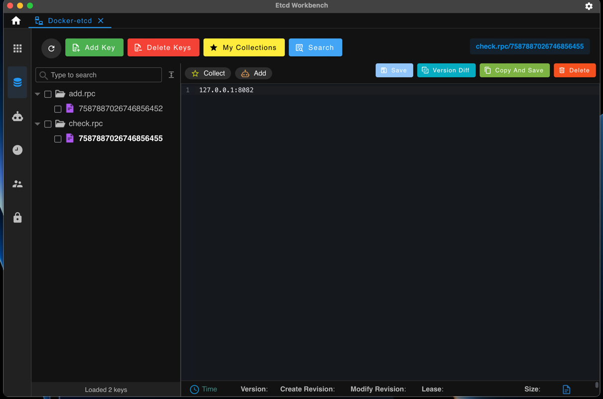
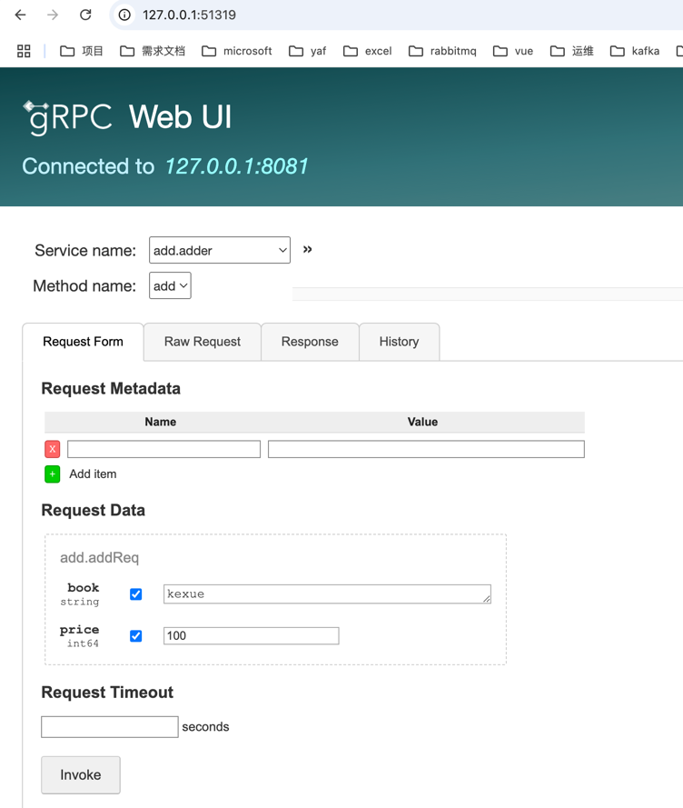
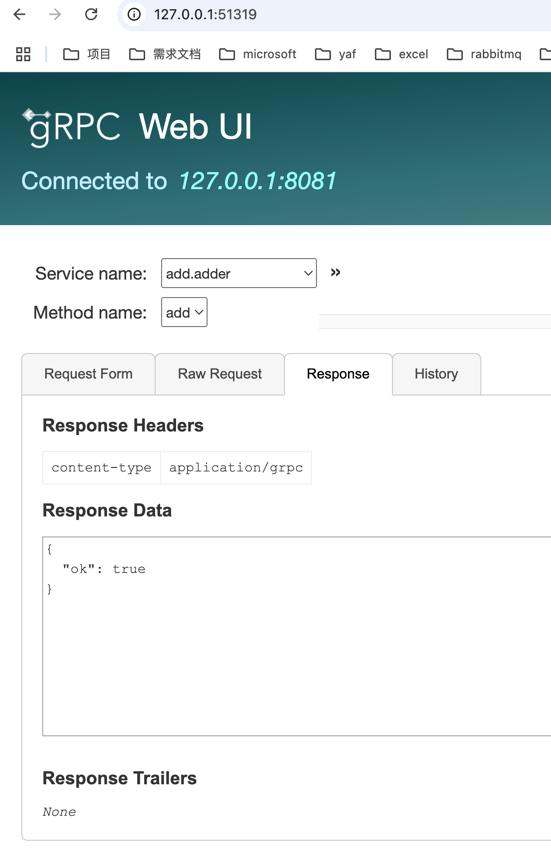

## 基于go-zero实现的微服务项目demo

项目包含一个api服务，调用两个rpc服务

### 安装goctl和protobuf
```
brew install protoc     # protobuf安装
protoc --version


go install google.golang.org/protobuf/cmd/protoc-gen-go@latest # proto go语言插件安装


go install github.com/zeromicro/go-zero/tools/goctl@latest #安装goctl
goctl --version
```


### [部署etcd、mysql、redis](ops/docker-compose.yaml)
```
可视化工具我使用的是etcd-workbench；先前使用docker安装的etcd-keeper一直访问不通etcd服务端，可能是网络通信没弄好
```

### 项目初始化
```
mkdir bookstore
go mod init bookstore
```
初始化go.mod

### 创建Api GateWay项目
```
mkdir api
goctl api -o bookstore.api #生成api文件,编写http接口请求和相应参数，定义方法和路由

goctl api go --api bookstore.api --dir .  根据.api文件生成项目
```


### 创建add rpc 服务
```
mkdir rpc #api同级目录创建rpc文件

mkdir add 

goctl rpc -o  add.proto     # 创建proto文件，并编写


goctl rpc protoc  --go_out=.  --go-grpc_out=.  --zrpc_out=.  add.proto   #生成add rpc服务
  
``` 


### 创建check rpc 服务

```
mkdir check #api同级目录创建check文件

mkdir check 

goctl rpc -o  check.proto     # 创建proto文件，并编写


goctl rpc protoc  --go_out=.  --go-grpc_out=.  --zrpc_out=.  check.proto   #生成check rpc服务
 ```


### api 服务调用rpc 服务
1. 修改api项目配置文件api/etc/bookstore-api.yaml,添加两个rpc服务的服务发现
```
Add:
  Etcd:
    Hosts:
      - localhost:2379
    Key: add.rpc
Check:
  Etcd:
    Hosts:
      - localhost:2379
    Key: check.rpc
```

2. 添加/internal/config/config.go rpc服务配置
```
type Config struct {
	rest.RestConf
	Add   zrpc.RpcClientConf  # add rpc
	Check zrpc.RpcClientConf # check rpc
}
```

3. 修改api/internal/svc/servicecontext.go  注册rpc服务，添加依赖
```
type ServiceContext struct {
	Config config.Config
	Adder  adder.Adder // rpc client
	Check  checker.Checker 
}

func NewServiceContext(c config.Config) *ServiceContext {
	return &ServiceContext{
		Config: c,
		Adder:  adder.NewAdder(zrpc.MustNewClient(c.Add)),
		Check:  checker.NewChecker(zrpc.MustNewClient(c.Check)),
	}
}
```

4.修改api/internal/logic/addlogic.go调用微服务项目
```
//调用微服务
resp1, err := l.svcCtx.Adder.Add(l.ctx, &add.AddReq{
Book:  req.Book,
Price: req.Price,
})
```


### 调试
etcd微服务注册结果



安装grpcurl 和grpcui
[官方地址](https://github.com/fullstorydev/grpcurl)

mac 安装如下
```
brew install grpcurl
brew install grpcui
```
注grpcurl是基于反射的，需要在rpc项目启动时添加
```
if c.Mode == service.DevMode || c.Mode == service.TestMode {
	reflection.Register(grpcServer)
}
```

1.查看服务列表
```
tdd@TddM1-Pro update % grpcurl -plaintext 127.0.0.1:8081 list
add.adder
grpc.health.v1.Health
grpc.reflection.v1.ServerReflection
grpc.reflection.v1alpha.ServerReflection

```
2.查看服务法方法
```
tdd@TddM1-Pro update % grpcurl -plaintext 127.0.0.1:8081 list add.adder
add.adder.add

```
3.查看详情
```
tdd@TddM1-Pro update % grpcurl -plaintext 127.0.0.1:8081 describe add.adder
add.adder is a service:
service adder {
  rpc add ( .add.addReq ) returns ( .add.addResp );
}

```


grpcui-页面工具
```
tdd@TddM1-Pro ops % grpcui -plaintext 127.0.0.1:8081                    
gRPC Web UI available at http://127.0.0.1:51319/
```

浏览器打开上面返回的地址链接：



